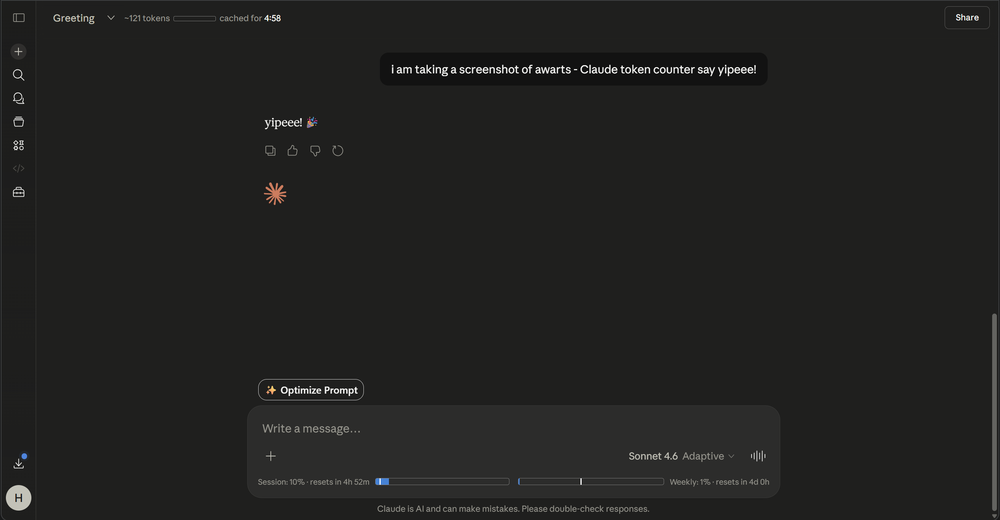

<div align="center">


<a href="https://git.io/typing-svg"></a>

<br/>

[](https://awarts.club)
[](https://convex.dev)
[](https://reactjs.org/)
[](https://www.typescriptlang.org/)

<br/>

### 🏆 Track, Share, and Compete in the New Era of AI-Assisted Development

[**Live Demo**](https://awarts.club) | [**Documentation**](https://awarts.club/docs) | [**Leaderboard**](https://awarts.club/leaderboard)

</div>

---

## 🚀 What is AWARTS?

**AWARTS** (AI Workflow Activity & Runtime Tracking System) is a social fitness tracker for AI-assisted coding. Think of it as **Strava for AI Developers**. 

### 🏃 Why "Strava for AI"?
Just like Strava tracks your runs and rides, AWARTS tracks your **vibe coding** sessions. Whether you are using **Claude Code**, **OpenAI Codex**, **Google Gemini**, or **Antigravity**, AWARTS quietly runs in the background, tracks your local usage automatically, and pushes it to a global leaderboard. 

*   **Compete** on global and country-specific leaderboards.
*   **Share** your coding sessions with the community.
*   **Maintain** daily coding streaks and earn "elite" badges.
*   **Analyze** your token usage and AI spend across all providers.

<div align="center">
  
</div>

## ✨ Features

🔥 **Background Tracking:** A silent CLI daemon (`awarts daemon start`) tracks your local usage automatically every hour.  
🌐 **Chrome Extension:** Seamlessly count Claude tokens straight from the web browser.  
📊 **Global Leaderboards:** See who is pushing the most AI code worldwide.  
🏅 **Achievements & Streaks:** Maintain your daily coding streak and unlock special badges.  
🔐 **Privacy First:** Only anonymous usage metrics (tokens, costs, providers) are sent to the cloud. Your source code and prompts **never** leave your machine.  

## 📦 Getting Started

You can install and setup the AWARTS CLI in seconds. It requires Node.js 18+.

```bash
# 1. Start the CLI
npx awarts@latest login

# 2. Sync your local AI usage
npx awarts@latest sync

# 3. Start the background daemon (auto-syncs every 1 hour)
npx awarts@latest daemon start
```

## 🛠️ Built With

*   **Frontend:** React (Vite), Tailwind CSS, Framer Motion, Recharts
*   **Backend:** Convex (Real-time database and serverless functions)
*   **Authentication:** Clerk (Email/Password & OAuth)
*   **CLI:** Node.js, Commander.js

## 🤝 Open Source Issues

AWARTS is currently seeking contributions for two major architectural improvements! Check out the active issues on GitHub:

*   [**Issue #20:** Support multi-account isolation for local token tracking](https://github.com/HarshalJain-cs/AWARTS/issues/20)
*   [**Issue #21:** Implement omnichannel tracking for all AI providers (Web, Desktop App, Terminal)](https://github.com/HarshalJain-cs/AWARTS/issues/21)

---

<div align="center">
  
  <p>Shipped by <b>Harry</b></p>
</div>
